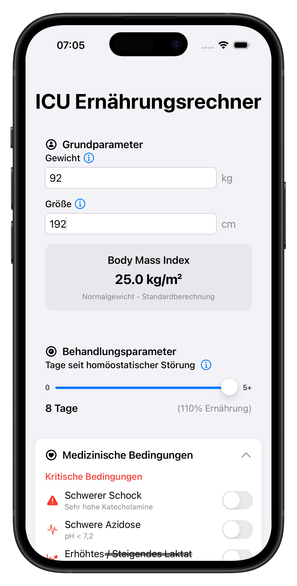
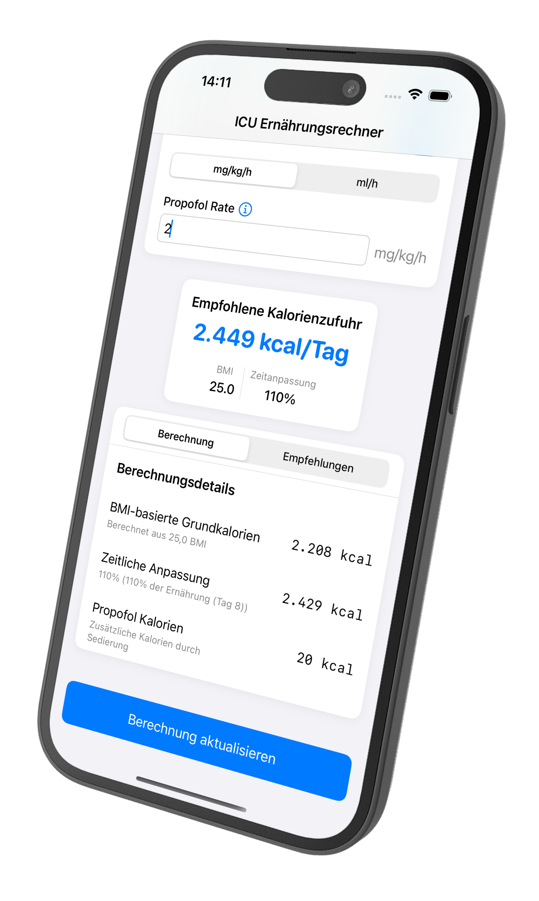

# ICUN – Optimierte Ernährung für Intensivpatienten

**ICUN** (Intensive Care Unit Nutrition) ist eine spezialisierte App zur Unterstützung der intensivmedizinischen Ernährungsversorgung. Sie ermöglicht eine präzise Berechnung des Kalorienbedarfs basierend auf klinischen Parametern und medizinischen Bedingungen.

## Funktionen der ICUN-App

### 📊 BMI- und Kalorienbedarf-Berechnung  
- Automatische Berechnung des **Body Mass Index (BMI)** anhand von Gewicht und Größe.  
- Individuelle Kalorienempfehlung basierend auf BMI und Behandlungssituation.  
- **Anpassung der Kalorienzufuhr** in Abhängigkeit vom **homöostatischen Zustand**.

### 💉 Propofol-Management  
- Eingabe der Propofol-Rate wahlweise in **mg/kg/h oder ml/h**.  
- Automatische **Kalorienberechnung aus Propofol** (1,1 kcal/ml).  
- **Validierung der Propofol-Dosis**, um Fehleingaben zu vermeiden.  

### 🚨 Medizinische Kontraindikationen  
- Berücksichtigung von **kritischen Bedingungen** wie **Schock, Azidose, Hypoxie** etc.  
- Falls eine Kontraindikation vorliegt, wird die **Berechnung blockiert**.  
- **Warnmeldungen und Ernährungsempfehlungen** je nach Patientenstatus.  

### ⏳ Behandlungssituation  
- **Schieberegler für die Tage seit homöostatischer Störung** (z. B. nach OP oder Schock).  
- Dynamische **Anpassung der Kalorienzufuhr** zwischen 0 % und 150 % je nach Behandlungsphase.  

### 📋 Ergebnisdarstellung mit Empfehlungen  
- **Detaillierte Berechnung** inkl. Propofol-Kalorien und Tagesanpassungen.  
- **Ernährungs- und Mobilisationsempfehlungen** basierend auf den Berechnungen.  
- Visuelle Darstellung des finalen **Kalorienbedarfs pro Tag**.  

### 🎛 Benutzerfreundliche Oberfläche  
- **Validierte Zahleneingabe** mit **Tooltips** zur Unterstützung.  
- Dynamische UI: **Automatische Anpassung der Eingabefelder** je nach Patientendaten.  
- **Intuitive Navigation** per SwiftUI mit klaren Kategorien und Modulen.  

## 🖥 Screenshots  

    
    

## 📩 Kontakt
Für weitere Informationen oder Anfragen kontaktieren Sie uns bitte unter: [philip.knoll@gmail.com](mailto:philip.knoll@gmail.com)
